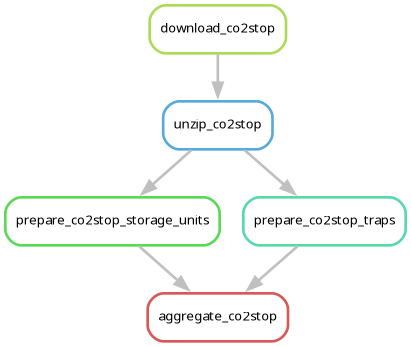
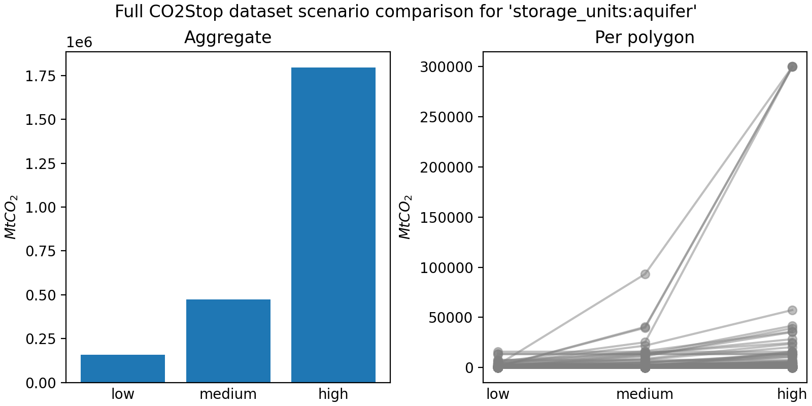
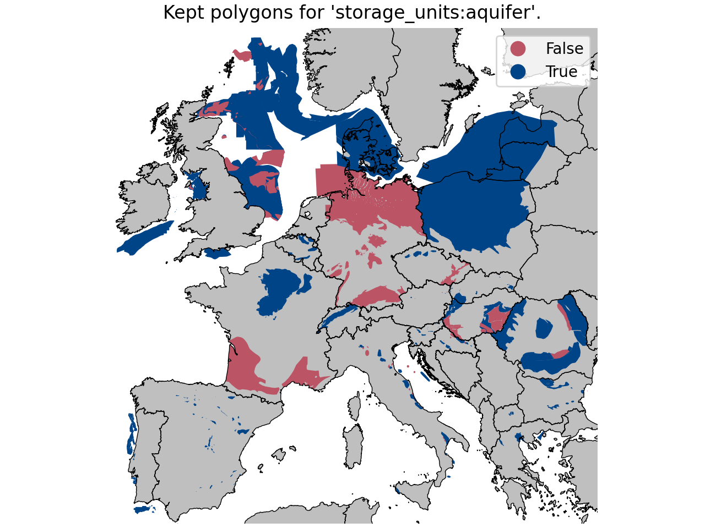

# Module CO2Stop - Carbon Dioxide Removal in Europe

A module to aggregate CDR potential in Europe into flexible spatial resolutions, using the CO2Stop dataset

## About this module
<!-- Please do not modify this templated section -->

This is a modular `snakemake` workflow built for [Modelblocks](https://www.modelblocks.org/) data modules.

This module can be imported directly into any `snakemake` workflow.
For more information, please consult:
- The Modelblocks [documentation](https://modelblocks.readthedocs.io/en/latest/).
- The integration example in this repository (`tests/integration/Snakefile`).
- The `snakemake` [documentation on modularisation](https://snakemake.readthedocs.io/en/stable/snakefiles/modularization.html).

## Development
<!-- Please do not modify this templated section -->

We use [`pixi`](https://pixi.sh/) as our package manager for development.
Once installed, run the following to clone this repository and install all dependencies.

```shell
git clone git@github.com:modelblocks-org/module_co2stop_cdr.git
cd module_co2stop_cdr
pixi install --all
```

For testing, simply run:

```shell
pixi run test-integration
```

To test a minimal example of a workflow using this module:

```shell
pixi shell    # activate this project's environment
cd tests/integration/  # navigate to the integration example
snakemake --use-conda --cores 2  # run the workflow!
```

## Documentation

### Overview
<!-- Please describe the processing stages of this module here -->

The analysis of the module is structured as follows:

<div style="width:50%; margin: auto;">


</div>

1. The CO2Stop dataset is downloaded and cleaned up following methods described in the [JRC - CO2 transport report](https://publications.jrc.ec.europa.eu/repository/handle/JRC136709).
2. To avoid double-counting, traps within the remaining storage units are removed as their capacity is already included in the storage unit total (please consult the [CO2Stop Final report](https://energy.ec.europa.eu/publications/assessment-co2-storage-potential-europe-co2stop_en) section 2.3.1 for details).
Additionally, the following removal criteria is applied to further clean the data:
    - Cases marked as 'not assessed' or as 'undisclosed' in the dataset.
    - Ambiguous duplicates (these are a few small traps located in the north sea with repeated IDs and capacities).
    - Optionally, details from the dataset are used to remove the following, if configured:
        - Qualitative cases marked as having surface or subsurface issues, and artificially created polygons.
        - Quantitative values (e.g., porosity, depth, ...).
3. Three scenarios (`low`, `medium`, `high`) are created for each sequestration type (`aquifer`, `gas`, `oil`) for the remaining CO2Stop data.
User-configured lower and upper bounds are applied per-polygon at this stage.
See `bounds_mtco2: co2stop_polygons` in the configuration schema for more information.
<div style="width:50%; margin: auto;">


</div>
4. The resulting sequestration potential is aggregated per scenario into user provided shapes.

>[!WARNING]
>Estimates from the CO2Stop dataset are biased by disclosure (or lack thereof), and the filtering settings used.
>Some countries are affected more than others, with Germany having particularly poor disclosure.
>
>Similarly, CO2Stop suffers from poor data handling practices that make unavailable data and 'true' zero values indistinguishable from each other, amplifying the uneven assignation of sequestration. For example: setting `porosity_ratio: 0.1` will completely remove France in most cases.
>
>We provide automated figures and logging (in `logs/storage_units/` and `logs/traps/`) so users can evaluate how their settings affect polygon selection.
>Below is an example for storage unit aquifers where only undisclosed and artificial polygons have been removed. This can be seen as a _MINIMUM_ amount of removals.
><div style="width:50%; margin: auto;">
>
>
></div>

### Configuration
<!-- Feel free to describe how to configure this module below -->

Please consult the configuration [README](./config/README.md) and the [configuration example](./config/config.yaml) for a general overview on the configuration options of this module.

### Input / output structure
<!-- Feel free to describe input / output file placement below -->

As input, all you need to provide is a `.parquet` shapes file with the polygons to aggregate capacities into. This file should follow the schema provided by the [geo-boundaries module](https://github.com/calliope-project/module_geo_boundaries/tree/v0.1.6).

Outputs for each input shape file can be requested per potential scenario (low, medium, high), and CDR group (aquifer, gas, oil, and total aggregate sum).

Please consult the [interface file](./INTERFACE.yaml) for more information.

### References
<!-- Please provide thorough referencing below -->

This module is based on the following research and datasets:

- **CO2Stop dataset**
Poulsen, N., Holloway, S., Neele, F., Smith, N.A., Kirk, K., 2012. CO2StoP Executive Summary (No. ENER/C1/154-2011-SI2.611598). GEOLOGICAL SURVEY OF DENMARK AND GREENLAND. <https://energy.ec.europa.eu/publications/assessment-co2-storage-potential-europe-co2stop_en>.
- **Shape schema definition:**
Ruiz Manuel, I. clio - module_geo_boundaries [Computer software]. <https://github.com/calliope-project/module_geo_boundaries/>.
- **Filtering minimum defaults:**
Van Den Broek, M., Brederode, E., Ramírez, A., Kramers, L., Van Der Kuip, M., Wildenborg, T., Turkenburg, W., Faaij, A., 2010. Designing a cost-effective CO2 storage infrastructure using a GIS based linear optimization energy model. Environmental Modelling & Software 25, 1754–1768. <https://doi.org/10.1016/j.envsoft.2010.06.015>.
